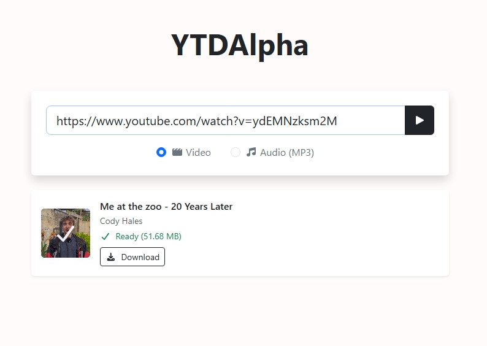

# YTDAlpha

**The Alpha of YT-DLP WebUI:**

Simple, clean, no pledging and no hazing.

YTDAlpha is a simple, clean web interface for yt-dlp that lets you paste a link and pull the best quality available — fast.

Just paste a URL and let it cook.

Because sometimes you just want the video without **writing a CLI thesis**.

## Features

- Alpha-tier simplicity – Paste link → download → done

- Best quality automatically via yt-dlp

- Clean Web UI — minimal action required

- Docker ready — spin it up in seconds

- No pledging — fully open source and runs on your own machine

## Screenshot



## Quick Start (Docker):

Spin up the house in one command:
```
docker run --rm -d -p 8080:8080 bboymega/ytdalpha:1.0
```

Then open your browser:
```
http://127.0.0.1:8080
```

Or if you're running it on a server:

```
http://[server-ip]:8080
```

You should now be able to access the WebUI locally, paste a URL, and chill.
